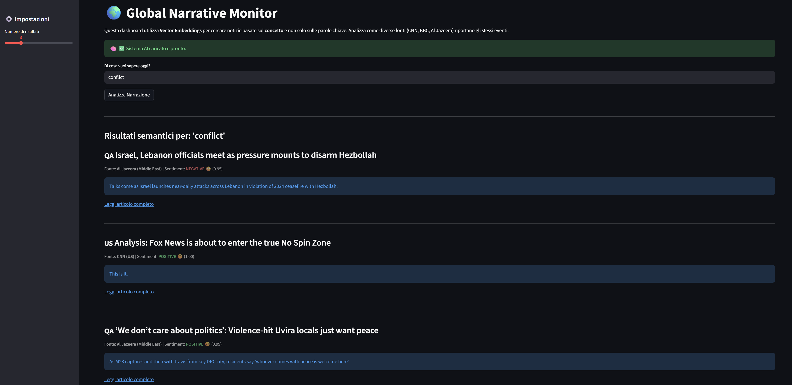

# 🌍 Global Narrative Monitor

An AI-powered dashboard to analyze how global media outlets narrate geopolitical events differently.

## 🚀 The Problem
In a polarized world, the same event is described in radically different ways depending on the source. Tracking these narrative shifts manually is impossible.

## 💡 The Solution
This tool builds an automated ETL pipeline that:
1.  **Ingests** news from diverse RSS feeds (CNN, BBC, Al Jazeera, etc.).
2.  **Embeds** text using Transformer models (`all-MiniLM-L6-v2`) into a Vector Database (**ChromaDB**).
3.  **Analyzes** sentiment using NLP (`DistilBERT`).
4.  **Visualizes** narrative differences via a **Streamlit** dashboard.

## 🛠️ Tech Stack
* **Language:** Python 3.10
* **AI/ML:** PyTorch, HuggingFace Transformers, SentenceTransformers
* **Data Engineering:** Pandas, ChromaDB (Vector Search)
* **Frontend:** Streamlit

## 📸 Screenshots

## 📦 How to Run
1. Clone the repo
2. Install dependencies: `pip install -r requirements.txt`
3. Run ingestion: `python ingestor.py`
4. Process data: `python processor.py`
5. Launch app: `streamlit run app.py`